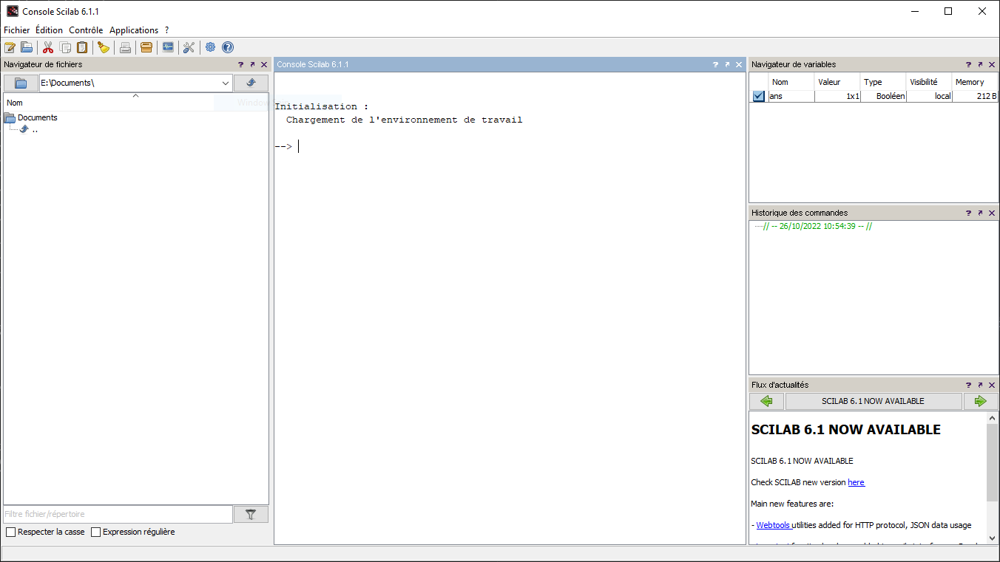

Scilab
======

# What does Scilab do?

Scilab includes hundreds of mathematical functions. It has a high-level programming language allowing access to advanced data structures, 2-D and 3-D graphical functions. A large number of functionalities is included in Scilab:

<dl>
  <dt>Maths & Simulation</dt>
  <dd>For usual engineering and science applications including mathematical operations and data analysis.</dd>

  <dt>2-D & 3-D Visualization</dt>
  <dd>Graphics functions to visualize, annotate and export data and many ways to create and customize various types of plots and charts.</dd>

  <dt>Optimization</dt>
  <dd>Algorithms to solve constrained and unconstrained continuous and discrete optimization problems.</dd>

  <dt>Statistics</dt>
  <dd>Tools to perform data analysis and modeling.</dd>

  <dt>Control System Design & Analysis</dt>
  <dd>Standard algorithms and tools for control system study.</dd>

  <dt>Signal Processing</dt>
  <dd>Visualize, analyze and filter signals in time and frequency domains.</dd>

  <dt>Application Development</dt>
  <dd>Increase Scilab native functionalities and manage data exchanges with external tools.</dd>

  <dt>Xcos - Hybrid dynamic systems modeler and simulator</dt>
  <dd>Modeling mechanical systems, hydraulic circuits, control systems...</dd>
</dl>
